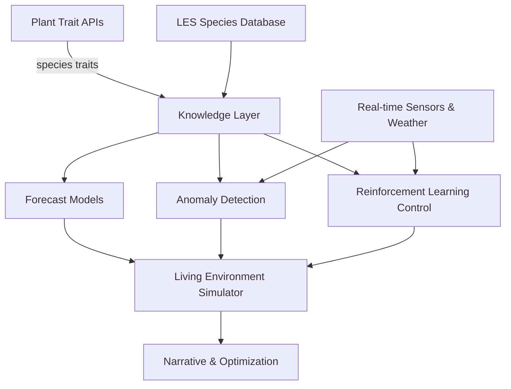

# AI Architecture Overview

This document outlines how static plant APIs such as Perenual and Verdant integrate with dynamic models and real-time operations in the Aquaponics Calculator and the broader Living Environment Simulator (LES).

## AI Feature Layers

1. **Data Enrichment & Knowledge Integration**
   - Trait prediction and completion across species.
   - Climate suitability scoring for plant/fish combinations.
   - Automated taxonomy linking.
2. **Live Operations Intelligence**
   - Sensor anomaly detection for pH, dissolved oxygen, and nutrients.
   - Predictive control using reinforcement learning.
   - Adaptive KPI optimization with Bayesian techniques.
3. **Scenario Simulation & Advisory**
   - Generative scenario building from natural language.
   - Multi-objective optimization for yields and environmental goals.
   - Narrative explainers for simulation outputs.

## High-level Flow

The knowledge layer blends static species data with LES-specific taxonomy. Forecasting, anomaly detection, and reinforcement learning models draw from this layer and live sensor streams. Their outputs inform the Living Environment Simulator, which drives scenario planning and advisory tools.
